# Farmer App

A Flutter app (prototype) for Selling and buying products. Act as an intermediate to buy products from the farmers and selling it to the customers. Developed with Role Based Access Control system.

# Screenshots

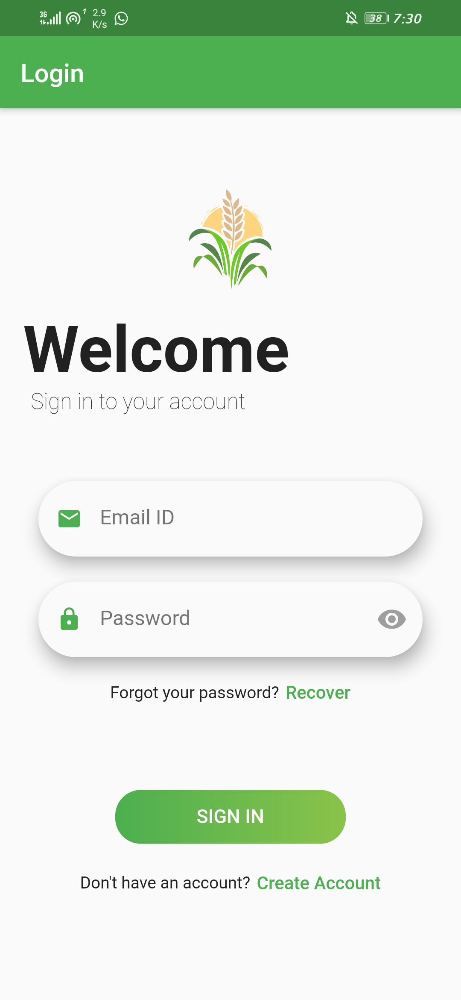
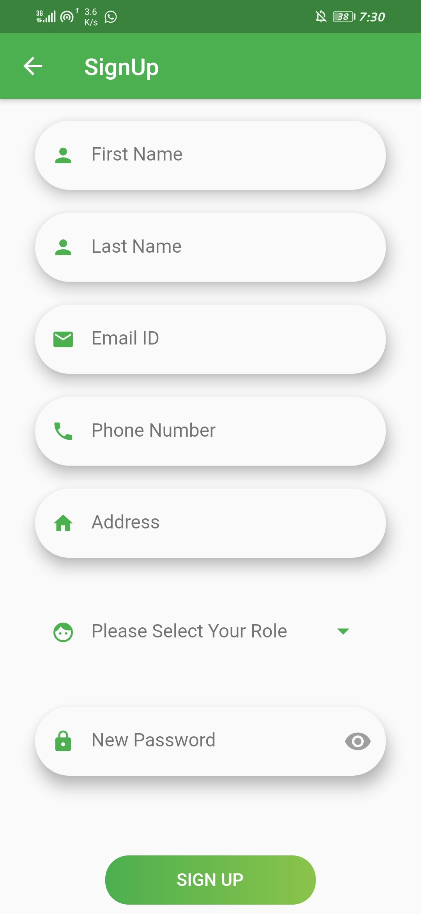
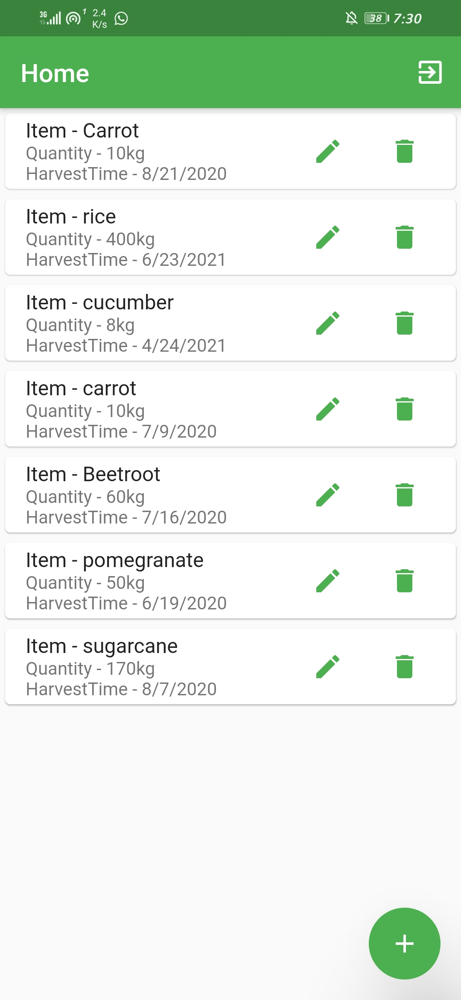
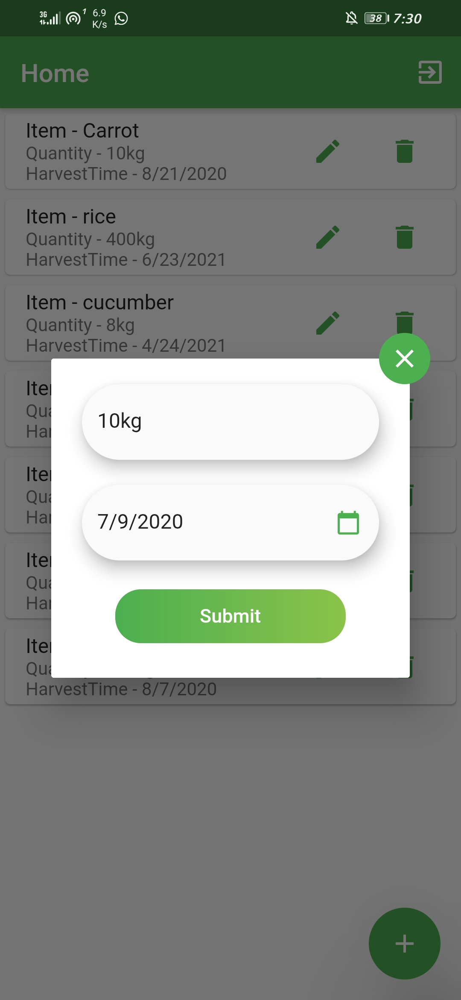
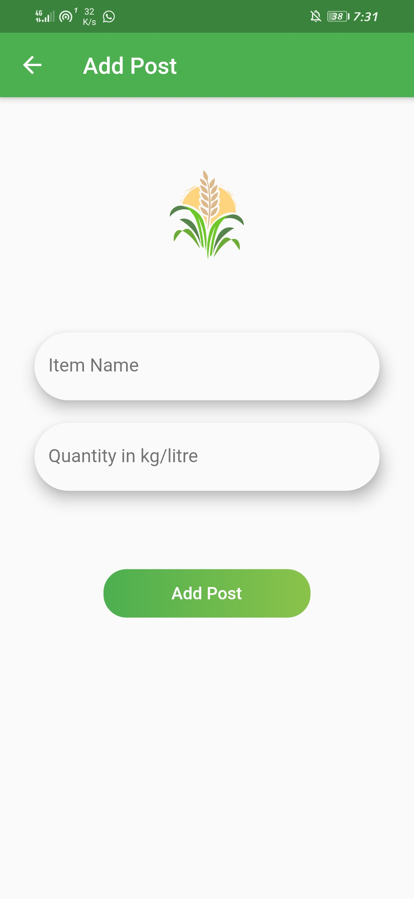
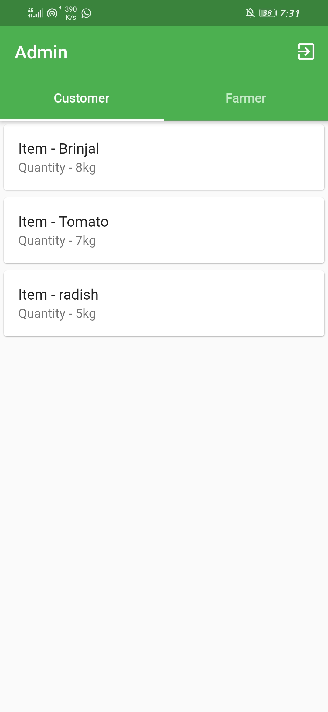
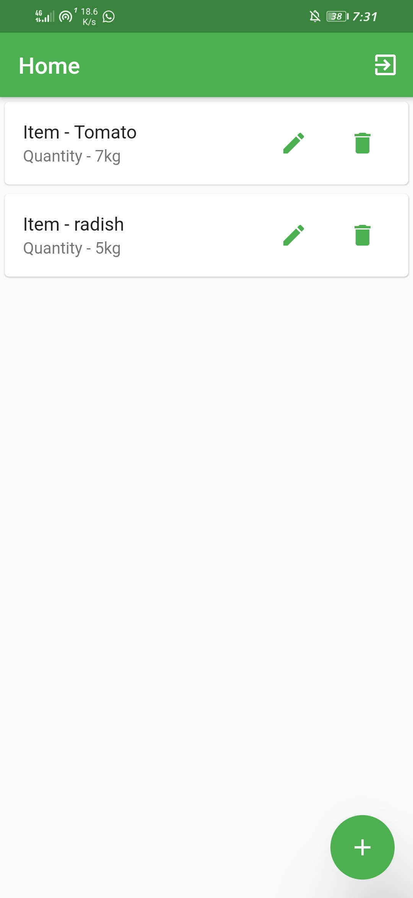
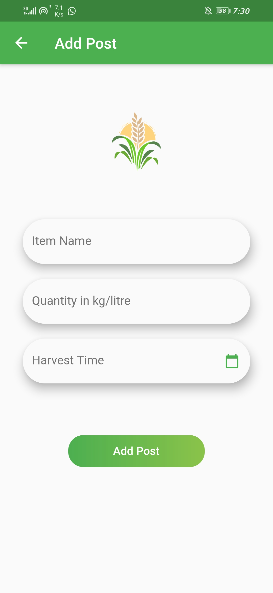
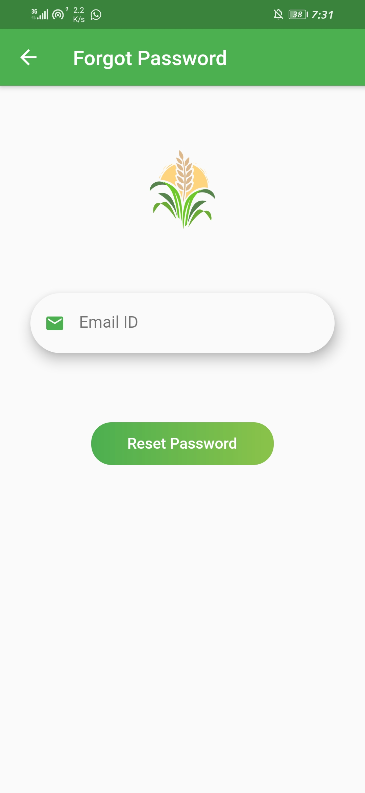
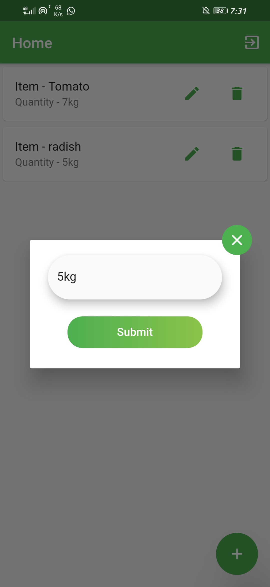
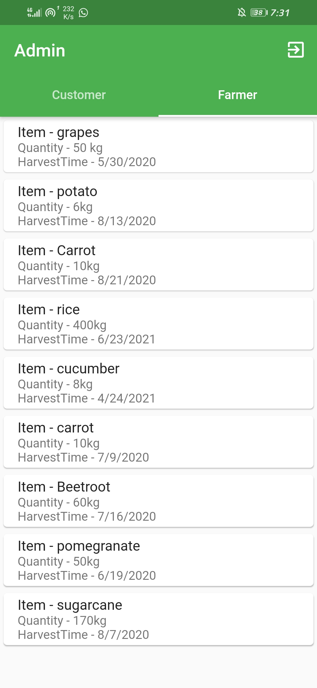
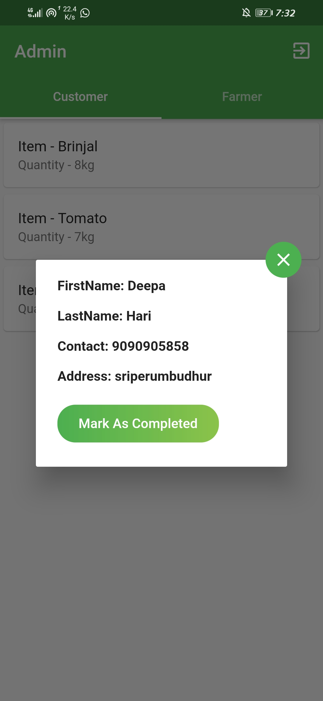
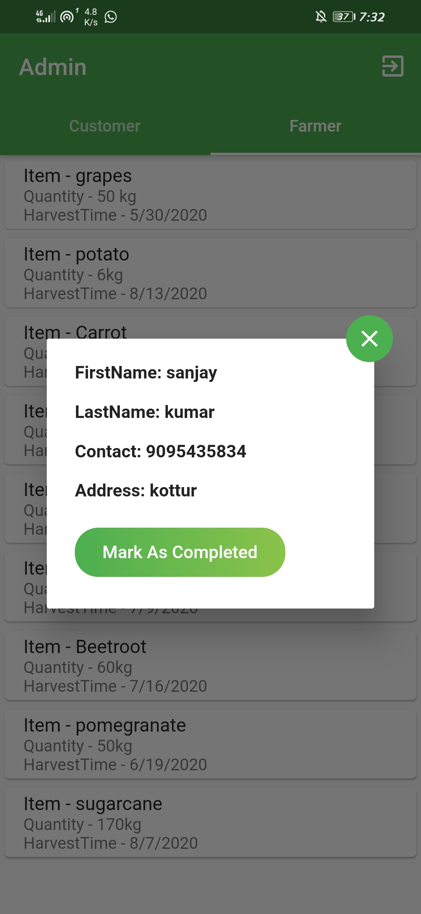

# Contributions
Contributions are welcome. Please read the [contributions guide](CONTRIBUTING.md) for more information.

# Getting Started

A few resources to get you started if this is your first Flutter project:

- [Lab: Write your first Flutter app](https://flutter.dev/docs/get-started/codelab)
- [Cookbook: Useful Flutter samples](https://flutter.dev/docs/cookbook)

For help getting started with Flutter, view our
[online documentation](https://flutter.dev/docs), which offers tutorials,
samples, guidance on mobile development, and a full API reference.
